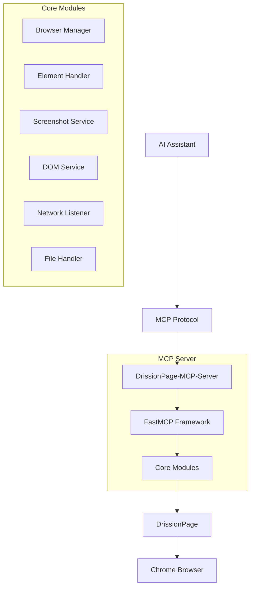
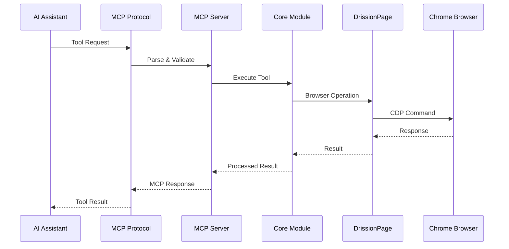
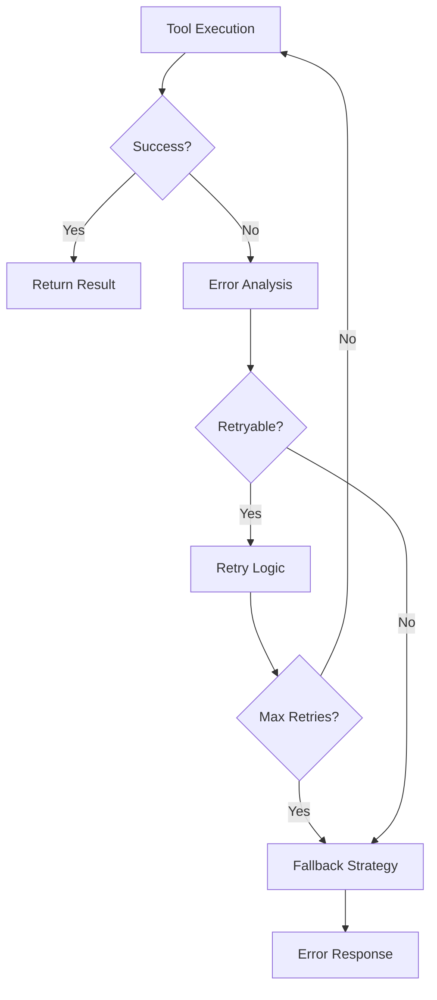

# 项目架构

本文档详细介绍 DrissionPage-MCP-Server 的架构设计、模块组织和设计理念。

## 架构概览

### 整体架构



### 设计原则

1. **模块化设计** - 职责分离，便于维护和扩展
2. **异步优先** - 提高并发性能和响应速度
3. **类型安全** - 完整的类型注解，减少运行时错误
4. **配置驱动** - 灵活的配置系统，适应不同环境
5. **错误处理** - 完善的异常处理和错误恢复机制

## 核心模块

### 1. 主入口模块 (main.py)

```python
# 主要职责
- MCP 服务器初始化
- 工具注册和路由
- 全局配置管理
- 生命周期管理
```

**关键组件：**
- `MCPServer` - MCP 服务器实例
- `ToolRegistry` - 工具注册表
- `ConfigManager` - 配置管理器

### 2. 浏览器管理 (browser_manager.py)

```python
# 核心功能
- 浏览器连接和启动
- 标签页管理
- 会话状态维护
- 资源清理
```

**设计特点：**
- 单例模式确保浏览器实例唯一性
- 连接池管理多个标签页
- 自动重连机制处理连接断开
- 优雅关闭和资源回收

### 3. 元素处理 (element_handler.py)

```python
# 主要功能
- 元素定位和选择
- 用户交互模拟
- 智能等待和重试
- 操作结果验证
```

**核心算法：**
- 多策略元素定位（CSS、XPath、文本）
- 智能等待机制（显式等待 + 轮询）
- 操作失败自动重试
- 元素可见性和可交互性检查

### 4. 截图服务 (screenshot_service.py)

```python
# 服务能力
- 全页面截图
- 元素截图
- 视口截图
- 截图优化和压缩
```

**技术实现：**
- CDP 协议直接调用
- 多种截图格式支持
- 自动文件命名和路径管理
- 内存优化和临时文件清理

### 5. DOM 服务 (dom_service.py)

```python
# 核心能力
- DOM 树遍历和解析
- 元素查找和过滤
- 页面内容提取
- 结构化数据输出
```

**算法优化：**
- 深度优先遍历算法
- 智能剪枝减少遍历开销
- 缓存机制提高查询效率
- 增量更新支持

### 6. 网络监听 (network_listener.py)

```python
# 监听功能
- HTTP 请求/响应拦截
- 网络事件监听
- 数据过滤和分析
- 性能指标收集
```

**实现细节：**
- CDP Network Domain 事件监听
- 异步事件处理队列
- 内存友好的数据存储
- 可配置的过滤规则

## 数据流架构

### 请求处理流程



### 错误处理流程



## 配置系统

### 配置层次结构

```python
# 配置优先级（从高到低）
1. 环境变量
2. 命令行参数
3. 配置文件
4. 默认配置
```

### 配置分类

```yaml
# 浏览器配置
browser:
  headless: false
  port: 9222
  timeout: 30
  user_data_dir: null

# 截图配置
screenshot:
  format: "png"
  quality: 90
  full_page: false
  path: "./screenshots"

# 网络配置
network:
  enable_monitoring: false
  filter_types: []
  max_logs: 1000

# 性能配置
performance:
  max_concurrent_tabs: 10
  element_timeout: 10
  page_load_timeout: 30
```

## 扩展机制

### 插件架构

```python
# 插件接口
class PluginInterface:
    def initialize(self, config: Dict) -> None:
        """插件初始化"""
        pass
    
    def register_tools(self, registry: ToolRegistry) -> None:
        """注册工具"""
        pass
    
    def cleanup(self) -> None:
        """清理资源"""
        pass
```

### 工具扩展

```python
# 自定义工具示例
@tool
async def custom_tool(
    param1: str,
    param2: Optional[int] = None
) -> str:
    """自定义工具描述"""
    # 工具实现
    return "result"
```

## 未来规划

- 当前版本工具数量为17个，其中关于文本获取可进行合并，未来计划进一步降低工具耦合度，以提高复用率，同时降低对LLM的负担
- 未来计划增加更多工具，因为项目处于初步完成阶段，只设计了常用的17个工具，未来会根据 DrissionPage 的功能进行进一步工具开发

---

本架构文档会随着项目发展持续更新，如有疑问请提交 Issue。